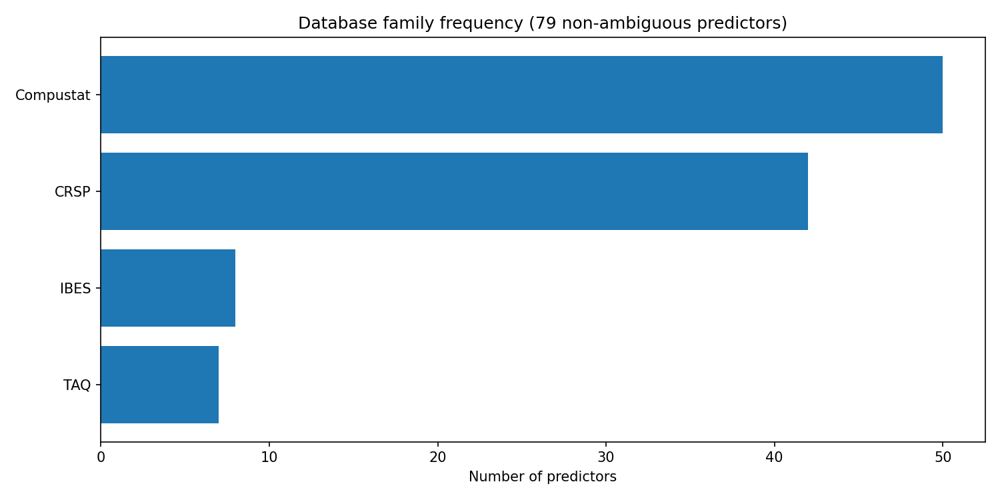
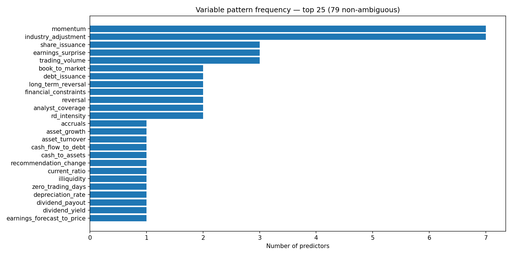
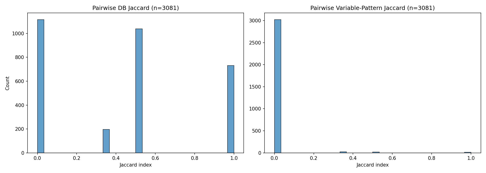
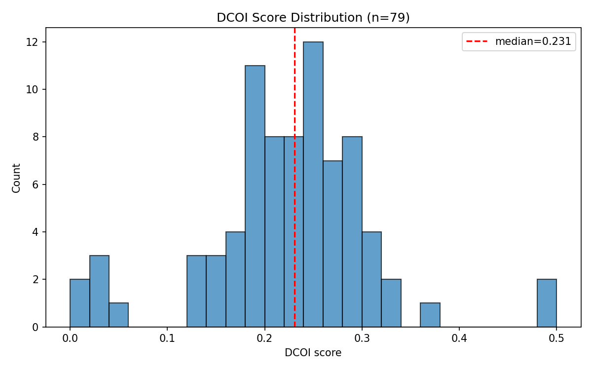
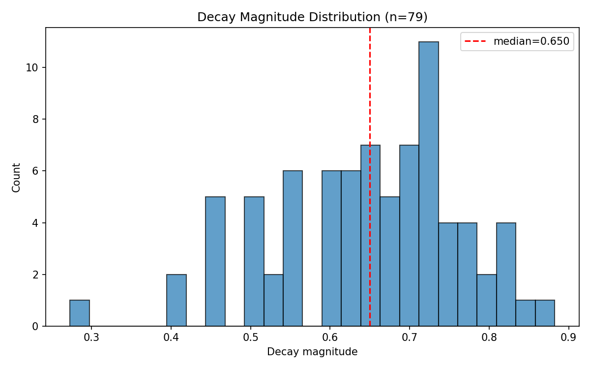

# Test 2 Diagnostic — Data Shape Inspection

**Date:** 2026-04-26
**Question:** Do the 97 McLean-Pontiff predictors vary enough on database-family and variable-pattern dimensions for DCOI to correlate with decay, in principle?

**Answer:** No. The variable-pattern dimension is effectively dead (98.1% of pairs have zero overlap), and the database-family dimension has only 4 families producing 8 distinct combinations. DCOI v1 is measuring a near-constant: "how much CRSP/Compustat do you share with the average prior predictor?" That cannot predict decay.

---

## 1. Database-family distribution

Only 4 database families appear across the 79 non-ambiguous predictors:

| Family | Count |
|--------|-------|
| Compustat | 50 |
| CRSP | 42 |
| IBES | 8 |
| TAQ | 7 |

There are only **8 distinct database-set combinations**. The largest single bucket is {Compustat} alone, shared by **30/79 predictors** (38%). The next largest is {CRSP, Compustat} with 20 predictors.

The database-family space is extremely coarse. Most predictors are either {Compustat}, {CRSP}, or {CRSP, Compustat}. There are only 4 families and 8 combinations for 79 predictors — a handful of discrete buckets, not a continuous dimension.

## 2. Variable-pattern distribution

**70 distinct variable-pattern sets** across 79 predictors — nearly every predictor has a unique set.

Top patterns by frequency:

| Pattern | Count |
|---------|-------|
| momentum | 7 |
| industry_adjustment | 7 |
| share_issuance | 3 |
| earnings_surprise | 3 |
| trading_volume | 3 |
| book_to_market | 2 |
| debt_issuance | 2 |

Most patterns appear exactly once. The largest variable-set bucket is {momentum} with 4 predictors.

How many other predictors share at least one pattern with a given predictor?

| Stat | Value |
|------|-------|
| Min | 0 |
| Max | 12 |
| Mean | 1.5 |
| **Median** | **0** |

The median predictor shares no variable patterns with any other predictor. The variable-pattern dimension provides almost no overlap signal.

## 3. Pairwise overlap distribution

3,081 predictor pairs examined.

### Database Jaccard

| Stat | Value |
|------|-------|
| Jaccard = 0 (no overlap) | **36.2%** |
| Jaccard = 1 (identical) | **23.7%** |
| Mean | 0.4269 |
| Median | 0.5000 |

The database Jaccard is bimodal: about a third of pairs share nothing, about a quarter are identical. This is because most predictors use {CRSP}, {Compustat}, or both — pairs from the same bucket get 1.0, pairs from disjoint buckets get 0.0, and CRSP-vs-{CRSP,Compustat} pairs get 0.5.

### Variable-pattern Jaccard

| Stat | Value |
|------|-------|
| Jaccard = 0 (no overlap) | **98.1%** |
| Jaccard = 1 (identical) | 0.4% |
| Mean | 0.0101 |
| Median | 0.0000 |

**98.1% of pairs have zero variable-pattern overlap.** The variable-pattern dimension is dead. It contributes nothing to DCOI for almost all pairs.

## 4. DCOI score distribution

| Stat | Value |
|------|-------|
| Min | 0.0 |
| Max | 0.5 |
| Mean | 0.2242 |
| Median | 0.2308 |
| Std | 0.0864 |
| DCOI = 0 | 1/79 |
| DCOI >= 0.5 | 2/79 |

The DCOI distribution is compressed into [0, 0.5] with standard deviation 0.09. The maximum possible score is 0.5 because the variable-pattern component is almost always 0, and the formula averages the two dimensions equally. DCOI is effectively measuring half the database Jaccard, averaged over all priors.

Only 1 predictor has DCOI = 0 (the first published). Only 2 have DCOI >= 0.5 (dividend_payout_ratio and dividend_yield — both {CRSP, Compustat} predictors published late with many {CRSP, Compustat} priors).

## 5. Decay distribution

| Stat | Value |
|------|-------|
| Min | 0.2727 |
| Max | 0.8824 |
| Mean | 0.6452 |
| Median | 0.6500 |
| Std | 0.1176 |

All 79 predictors decay (no negative values). The range [0.27, 0.88] has moderate spread but the distribution is roughly bell-shaped around 0.65. There is genuine variation in decay, so the target variable is not the problem.

## 6. Scatter plot, examined

The scatter (from the correlation PR) is a cloud with no structure. The high-DCOI predictors (dividend_payout_ratio, dividend_yield, book_to_market) are a small handful at the right edge, not a meaningful group. There is no visible clustering.

The wrong-sign correlation (rho = -0.19) is not driven by obvious outliers — the entire cloud is flat-to-slightly-downward. The mild negative slope may be a coincidence of the few high-DCOI predictors (dividends, BM) having moderate decay values while the mean decay is slightly higher.

## 7. The 18 ambiguous predictors

| # | ID | Ambiguity reason |
|---|-----|-----------------|
| 4 | beta_arbitrage | Construction details require return data; exact database dependencies not fully clear |
| 6 | capital_turnover | DOI not readily available; venue and date inferred |
| 8 | cash_productivity | Publication venue uncertain; may be working paper |
| 10 | change_in_forecast_and_accrual | Combined predictor; requires both accounting and analyst data |
| 20 | earnings_consistency | Publication details inferred; exact journal/DOI uncertain |
| 27 | firm_age_momentum | Combined predictor; interaction or separate metric unclear |
| 44 | inventory_growth | Venue may be Review of Finance or Journal of Finance |
| 53 | momentum_and_lt_reversal | Chan and Kot (2006) citation incomplete |
| 56 | net_debt_finance | Citation may reference wrong primary source |
| 57 | net_equity_finance | Citation may reference wrong primary source |
| 65 | oscore | OScore typically refers to Dichev's bankruptcy model; naming confusion |
| 66 | percent_accruals | Venue not confirmed |
| 67 | percent_operating_accruals | Venue not confirmed |
| 68 | price | Reference about dividend taxation; unclear if directly about price |
| 73 | real_dirty_surplus | Venue not confirmed |
| 76 | return_on_invested_capital | Brown and Rowe (2007) citation incomplete |
| 89 | sustainable_growth | Lockwood and Prombutr (2010) citation incomplete |
| 97 | zscore | Altman (1968) vs Dichev (1998) confusion |

Most ambiguity is about citation metadata (DOI, venue), not about database families or variable patterns. The exclusion of these 18 is unlikely to change the structural findings above.

## 8. Spot-check: 5 random predictors

| Predictor | DB families | Variable patterns |
|-----------|-------------|-------------------|
| dividend_yield | CRSP, Compustat | dividend_yield |
| book_to_market | CRSP, Compustat | book_to_market |
| intangibles_to_total_assets | Compustat | intangible_assets |
| industry_adjusted_long_term_reversal | CRSP | long_term_reversal, industry_adjustment |
| industry_adjusted_bm | CRSP, Compustat | book_to_market, industry_adjustment |

These look correct for the predictors Klas knows. Dividend yield uses CRSP returns and Compustat dividends. Book-to-market uses CRSP market cap and Compustat book value. Intangibles come from Compustat balance sheet. Industry-adjusted predictors use CRSP returns for the adjustment baseline. The LLM extraction got the coarse structure right.

## 9. Closing assessment

The dimension space is not rich enough for any formula on these two dimensions to correlate with decay.

The database-family dimension has only 4 families and 8 combinations for 79 predictors. It creates a handful of coarse buckets, not a continuous signal. The variable-pattern dimension is essentially dead: 98.1% of pairs have zero overlap because the LLM assigned highly specific, nearly unique patterns to each predictor. DCOI v1 is therefore measuring half the database Jaccard, averaged over priors — a near-constant that encodes "what fraction of your priors used the same 1-2 databases you did."

The problem is not that the formula is mathematically wrong. The problem is that the input dimensions do not carry enough variation across this dataset to distinguish predictors from each other in a way that correlates with their decay behavior. A formula that averages over near-zero variable overlap and 4-family database overlap cannot produce a signal rich enough to predict a continuous target variable.

Whether richer dimensions (more granular variable construction, data-column-level overlap, methodology features) would help is a separate question that this diagnostic does not answer.

---

*End of Test 2 diagnostic.*
