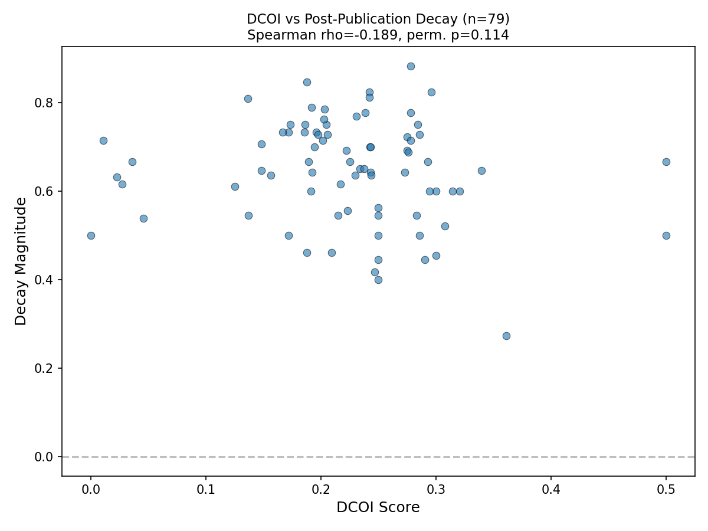

# Phase 1.5 Empirical Test 2 — DCOI Correlation Results

**Date:** 2026-04-26
**Outcome:** FAIL

The v1 DCOI formula does not correlate positively with post-publication decay magnitude across the McLean-Pontiff 97. The observed Spearman rho is -0.19 (negative), well below the preregistered threshold of rho >= 0.3. The permutation null test also fails to reject (p = 0.114). Per preregistration, this is a finding about the formula, not a license to retune.

## Numbers

| Metric | Value | Threshold | Pass? |
|--------|-------|-----------|-------|
| Spearman rho | -0.1895 | >= 0.3 | No |
| Spearman p-value | 0.0944 | < 0.05 | No |
| Permutation null p (1000 iter, seed=42) | 0.1140 | < 0.05 | No |

## Sample

- Total predictors: 97
- Ambiguous (excluded): 18
- Used in correlation: 79

## Top 5 highest-DCOI predictors

| Predictor | DCOI | Decay |
|-----------|------|-------|
| dividend_payout_ratio | 0.50 | 0.67 |
| dividend_yield | 0.50 | 0.50 |
| book_to_market | 0.36 | 0.27 |
| momentum_reversal | 0.34 | 0.65 |
| industry_adjusted_size | 0.32 | 0.60 |

## Bottom 5 lowest-DCOI predictors

| Predictor | DCOI | Decay |
|-----------|------|-------|
| forecast_dispersion | 0.04 | 0.67 |
| earnings_forecast_to_price | 0.03 | 0.62 |
| days_with_zero_trades | 0.02 | 0.63 |
| sparse_analyst_forecast | 0.01 | 0.71 |
| earnings_to_price | 0.00 | 0.50 |

## Scatter plot

## Null distribution

| Stat | Value |
|------|-------|
| Mean | 0.0005 |
| Std | 0.1151 |
| 5th percentile | -0.1838 |
| 95th percentile | 0.1879 |

The observed rho (-0.19) sits at the left edge of the null distribution, barely outside the 5th percentile. It is more negative than chance, but not significantly so.

## Interpretation

The v1 DCOI formula — Jaccard overlap on database families and variable patterns, mean-aggregated over all prior predictors — does not predict post-publication decay in the expected direction. The correlation is weakly negative: predictors with *more* data-coupling overlap actually show slightly *less* decay (or more survival), though this effect is not statistically significant.

Three non-exclusive explanations:

1. **The formula is wrong.** Jaccard over flat label sets may be too coarse to capture the operational structure that drives reflexive decay. Richer representations (variable construction depth, actual data overlap at the column level) might be needed.

2. **The extraction is noisy.** Haiku extraction produced 18 ambiguous predictors (excluded) and the variable patterns are LLM-generated labels, not ground-truth hand-codings. Extraction noise could mask a real signal. However, the effect direction is wrong (negative, not positive), and noise typically attenuates toward zero, not reverses sign.

3. **The hypothesis is wrong.** Data-coupling overlap may not be the primary driver of post-publication decay. Other mechanisms — crowding via popularity, regime change, data-mining bias — may dominate. The DCOI captures a structural property of predictor construction, but decay may be driven by behavioral dynamics that operate independently of construction overlap.

## What this means for the commercial thesis

The DCOI-based prediction of reflexive decay does not hold at v1. This does not invalidate the broader convergence framework (which tracks measurement agreement, not predictor overlap), but it means the specific commercial claim — that data-coupling overlap predicts decay magnitude — is not supported by this test.

Per the preregistration discipline: the v1 formula is not retuned. If a v2 is attempted, it requires its own preregistration, a distinct hypothesis, and fresh extraction.

## Extraction quality concerns

- 18/97 predictors marked ambiguous by Haiku (excluded from correlation).
- 5 non-ambiguous predictors lack DOI/URL (audit trail incomplete for those).
- Variable patterns are LLM-generated free-form labels (79 new patterns beyond Stage 1's map). No ground-truth validation against hand-coded values.
- Decay labels are LLM-transcribed from M-P Table 6, not hand-verified. The validation test (computed decay_magnitude within 0.01 of (in-out)/in) passed, catching internal consistency but not transcription accuracy against the original table.

---

*End of Test 2 results.*
