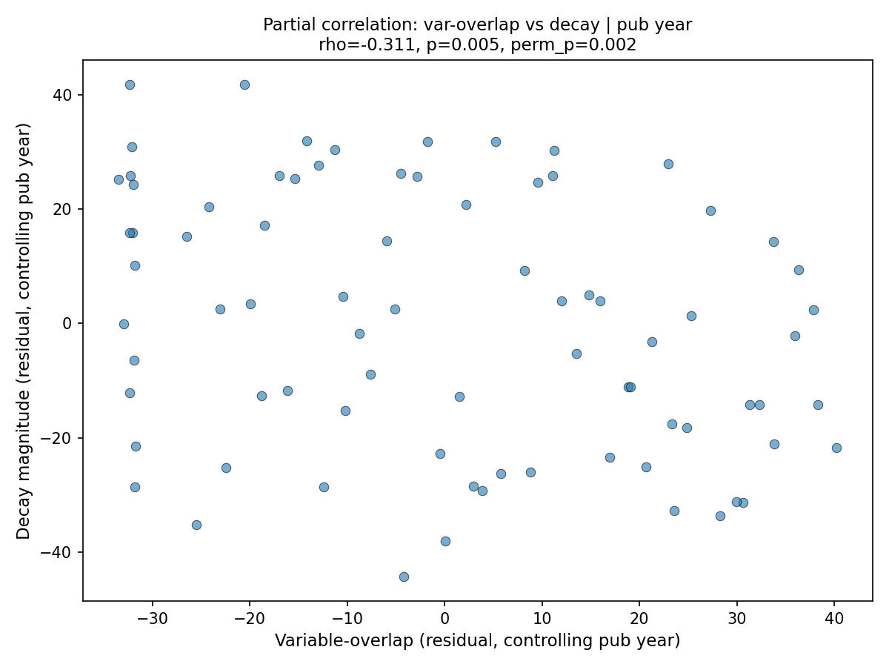

# Test 2 v2 Confound Check Results

**Date:** 2026-04-26
**Classification:** signal-survives

The wrong-sign variable-only correlation (rho = -0.29, p = 0.010) survives all three confound controls. None of the tested confounds explain the signal.

---

## Baseline

Variable-only overlap (v2 coarsened) vs decay: **rho = -0.288, p = 0.010**

## Confound 1: Publication year

| Bivariate | rho | p |
|-----------|-----|---|
| var-overlap vs year | 0.032 | 0.778 |
| decay vs year | 0.192 | 0.091 |

Variable-overlap is essentially uncorrelated with publication year (rho = 0.03). Older predictors do not mechanically have higher overlap.

**Partial correlation (controlling year): rho = -0.312, p = 0.005, perm_p = 0.002**

The signal *strengthens* after controlling for publication year. Year is not a confound.

## Confound 2: Number of priors

| Bivariate | rho | p |
|-----------|-----|---|
| var-overlap vs n_priors | 0.044 | 0.703 |
| decay vs n_priors | 0.203 | 0.073 |

Variable-overlap is uncorrelated with the number of priors (rho = 0.04). Having more priors does not mechanically produce higher overlap.

**Partial correlation (controlling n_priors): rho = -0.314, p = 0.005, perm_p = 0.002**

Signal strengthens. Number of priors is not a confound.

## Confound 3: In-sample return magnitude

| Bivariate | rho | p |
|-----------|-----|---|
| var-overlap vs in_sample | 0.011 | 0.923 |
| decay vs in_sample | 0.382 | 0.001 |

In-sample return magnitude is strongly correlated with decay (rho = 0.38, p < 0.001) — predictors with larger in-sample returns decay more. But variable-overlap is completely uncorrelated with in-sample return (rho = 0.01).

**Partial correlation (controlling in_sample): rho = -0.287, p = 0.010, perm_p = 0.009**

Signal unchanged. In-sample return is not a confound for the variable-overlap signal, despite being a strong predictor of decay on its own.

## Interpretation

All three partial correlations stay significant (|rho| >= 0.2, p < 0.05) and same wrong-sign direction. The signal survives controls.

The key reason: variable-overlap (as measured by coarsened Jaccard) is essentially uncorrelated with all three confounds (rho = 0.03, 0.04, 0.01). It is measuring something orthogonal to publication timing, opportunity-for-overlap, and in-sample effect size. Controlling for these confounds does not attenuate the signal because there is nothing to attenuate — they are different dimensions.

The wrong-sign correlation is a candidate finding: predictors whose variable-construction patterns overlap more with prior literature tend to decay less after publication. This is consistent with shared operational substrate marking robustness rather than fragility.

---

*End of confound check results.*
