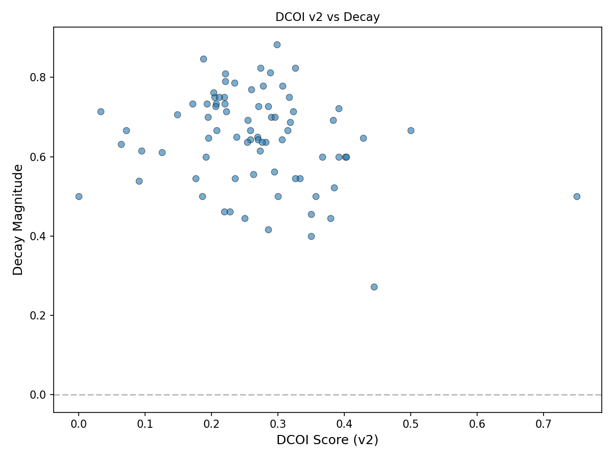

# Test 2 v2 — Variable-Pattern Coarsening Results

**Date:** 2026-04-26
**Outcome:** FAIL at preregistered threshold. But the side-diagnostics produce a significant wrong-sign result.

---

## Coarsening

- Input distinct patterns: 72
- Output canonical clusters: 13 (accruals, growth, valuation, profitability, momentum, risk, liquidity, leverage, issuance, analyst, size, short_interest, other)
- Pairwise variable-Jaccard = 0: **88.8%** (down from 98.1% in v1, but still very high)

The coarsening reduced zero-overlap pairs from 98.1% to 88.8%. An improvement, but still nearly 9 in 10 pairs share no variable pattern even at this coarseness level.

## v2 Full DCOI Correlation

| Metric | v2 | v1 (comparison) |
|--------|-----|----------------|
| Spearman rho | **-0.2038** | -0.1895 |
| p-value | 0.0716 | 0.0944 |
| Permutation null p | 0.0780 | 0.1140 |
| DCOI range | [0.00, 0.75] | [0.00, 0.50] |
| DCOI median | 0.2692 | 0.2308 |
| DCOI std | 0.1073 | 0.0864 |

Coarsening widened the DCOI distribution slightly (std 0.11 vs 0.09, max 0.75 vs 0.50) but the correlation got slightly *more* negative (-0.20 vs -0.19). Still wrong-sign. Still fails the preregistered threshold (rho >= 0.3, null_p < 0.05) on both axes.

## Side-Diagnostics

These are the most informative result of this stage.

### Variable-only correlation (v2 coarsened patterns, ignoring databases)

| Metric | Value |
|--------|-------|
| Spearman rho | **-0.2880** |
| p-value | **0.0101** |
| Permutation null p | **0.0080** |

**Statistically significant at p < 0.01.** But the direction is **wrong-sign**: more variable-pattern overlap with prior predictors predicts *less* decay.

### Database-only correlation (ignoring variable patterns)

| Metric | Value |
|--------|-------|
| Spearman rho | -0.1553 |
| p-value | 0.1716 |
| Permutation null p | 0.1810 |

Not significant. The database dimension carries no signal.

## What the side-diagnostics mean

The variable-pattern dimension, once properly coarsened, produces a real and significant correlation with post-publication decay — but it goes the wrong way. Predictors whose variable construction overlaps more with prior work tend to decay *less*, not more.

This is not a measurement failure. The dimension has signal; the hypothesis is wrong about the sign.

One interpretation: predictors sharing variable patterns with many prior predictors are the ones using well-established, robust financial constructs (momentum, valuation, profitability). These constructs have enduring empirical content. Predictors with unique, novel constructs — lower overlap with priors — may be more data-mined and more prone to post-publication decay. If so, DCOI is measuring something real, but the "reflexive degradation" story has it backwards: shared operational substrate is a sign of robustness, not fragility.

The database dimension adds nothing. The 4-family, 8-combination space is too coarse to discriminate.

## Verdict

**v2 FAIL** at the preregistered threshold for the full DCOI correlation.

**Significant wrong-sign finding** on the variable-only dimension: rho = -0.29, perm_p = 0.008. This is strong enough to constrain any v3 attempt: the variable-pattern dimension *works* but in the opposite direction from the reflexive-degradation hypothesis.

---

*End of Test 2 v2 results.*
